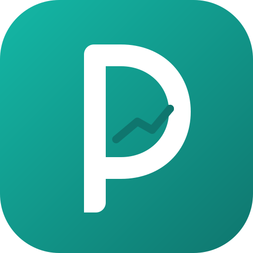
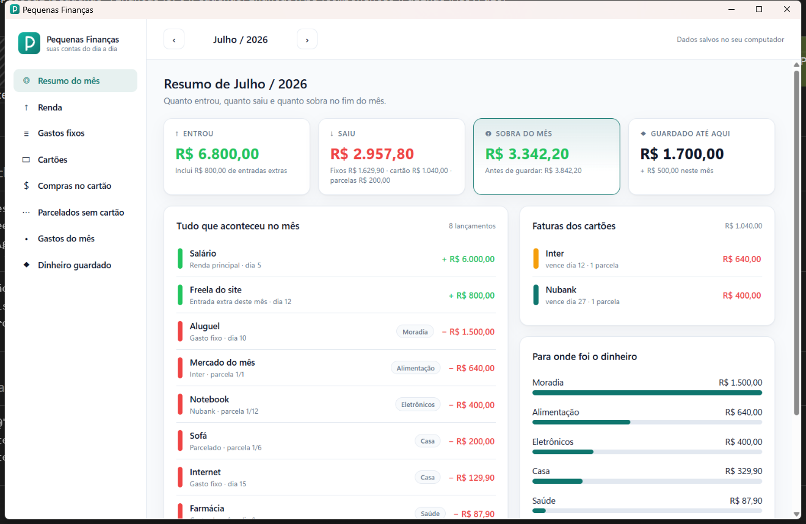
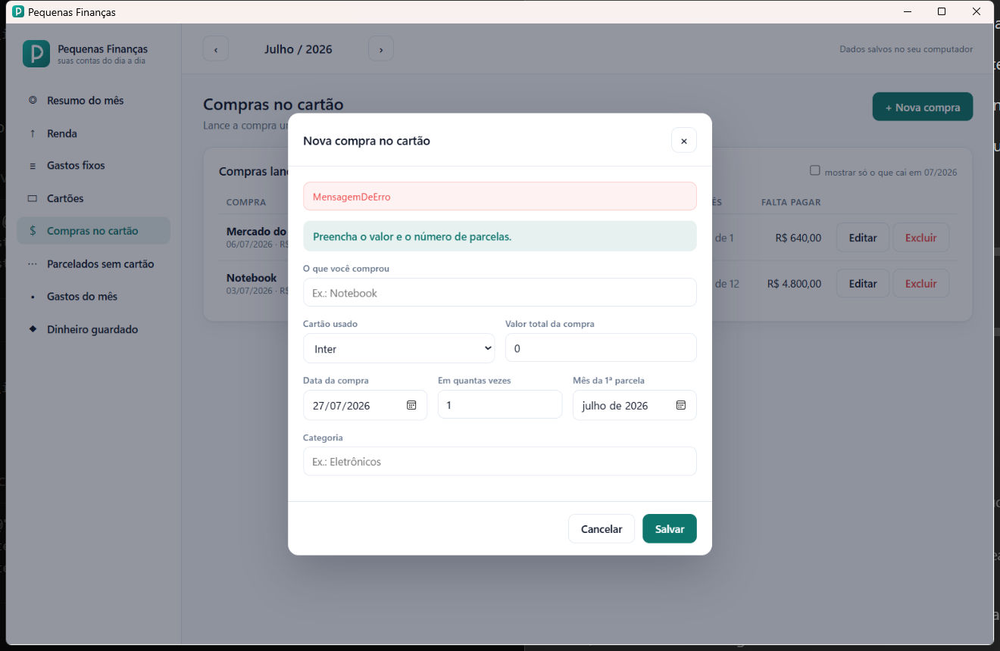

# Pequenas Finanças


Aplicativo de computador para o **registro simples das finanças do dia a dia**.

Sem complicação de sistema contábil e sem cadastro na internet: você anota o que entra,
o que sai e o que ficou parcelado, e o app responde a única pergunta que importa —
**quanto sobra no fim do mês.**

## Status

O aplicativo **está em produção** e em uso no dia a dia.



## O que ele faz

- **Renda** — cadastre o salário uma vez e ele aparece sozinho em todos os meses.
  Também dá para lançar entradas que vieram só naquele mês (freela, 13º, uma venda).
- **Gastos fixos** — aluguel, internet, escola: cadastre uma vez, com mês de início e
  de fim, e a conta se repete pelos meses.
- **Cartões de crédito** — cadastre seus cartões com limite, fechamento e vencimento.
- **Compras no cartão** — lance a compra uma vez, informe em quantas vezes e em qual
  cartão. As parcelas aparecem sozinhas em cada mês, com o progresso (`3/12`).
- **Parcelados sem cartão** — carnê, boleto ou empréstimo, separados das faturas.
- **Gastos do mês** — aquele gasto solto, pago à vista.
- **Dinheiro guardado** — crie reservas e registre quanto guardou (ou resgatou) em
  qualquer mês, com saldo acumulado e barra de progresso até o objetivo.
- **Resumo do mês** — abre sempre no mês atual e mostra quanto entrou, quanto saiu,
  quanto foi guardado e quanto sobra, com os gastos somados por categoria.



## Como a sobra é calculada

```
Sobra = renda + entradas extras
      − gastos fixos
      − parcelas dos cartões
      − parcelas fora do cartão
      − gastos do mês
      − dinheiro guardado no mês
```

O resumo mostra também quanto sobraria **antes** de separar dinheiro na reserva.

As parcelas não são gravadas uma a uma: elas são calculadas a partir da compra. Quando o
valor não divide certinho, a última parcela absorve os centavos, para a soma bater com o
total (R$ 100 em 3x = 33,33 + 33,33 + 33,34).

## Tecnologias

- .NET 10
- WPF hospedando componentes Blazor (`BlazorWebView` + WebView2) — interface em Razor e CSS
- Banco de dados em um arquivo JSON simples
- Testes em xUnit

## Como executar

Você precisa de:

- Windows 10 ou 11
- [.NET 10 SDK](https://dotnet.microsoft.com/download)
- WebView2 Runtime (já vem instalado no Windows 11)

```bash
git clone https://github.com/igordeagostin/pequenas-financas.git
cd pequenas-financas

dotnet test                                     # roda os testes
dotnet run --project src/PequenasFinancas.App   # abre o aplicativo
```

Para gerar o executável:

```bash
dotnet publish src/PequenasFinancas.App -c Release
```

## Onde ficam os dados

```
%AppData%\PequenasFinancas\dados.json    seus dados
%AppData%\PequenasFinancas\backups\      cópias de segurança das últimas gravações
```

O arquivo é pessoal, fica só na sua máquina e **nunca** é versionado neste repositório.

## Estrutura do projeto

```
src/PequenasFinancas.Core/     regras de negócio e leitura/gravação do JSON
src/PequenasFinancas.App/      janela WPF, componentes Razor e CSS
tests/PequenasFinancas.Tests/  testes das regras de cálculo
docs/                          documentação funcional
```

## Documentação

- [Como usar o aplicativo](docs/documentacao-funcional.md) — explicação de cada tela, em
  linguagem simples.
- [CLAUDE.md](CLAUDE.md) — convenções de código do projeto.
